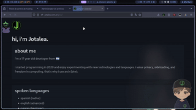

# ralsei.js

A script that makes Ralsei from Deltarune follow your mouse cursor. Based on [oneko.js](https://github.com/adryd325/oneko.js).

---

## Demo



## Features
- Ralsei follows your mouse pointer.
- Click to make him blush for 8 seconds.
- Grid-based movement like classic RPGs.
- Walking animations in all directions.

## Usage

### Client-side
If you want to add Ralsei on every website you browse, make a new bookmark with this content:
```javascript
javascript:(function(){var s=document.createElement('script');s.src='https://cdn.jsdelivr.net/gh/Jotalea/ralsei.js@main/ralsei.js';document.head.appendChild(s);})();
```
Then, whenever you click on this bookmark, Ralsei should appear and follow you.

Alternatively, you can use the TamperMonkey addon and add the ralsei.js script as a userscript in that extension.

### Server-side
If you want to add Ralsei to your own site, add this to your HTML:
```html
<script src="https://cdn.jsdelivr.net/gh/Jotalea/ralsei.js@main/ralsei.js"></script>
```
